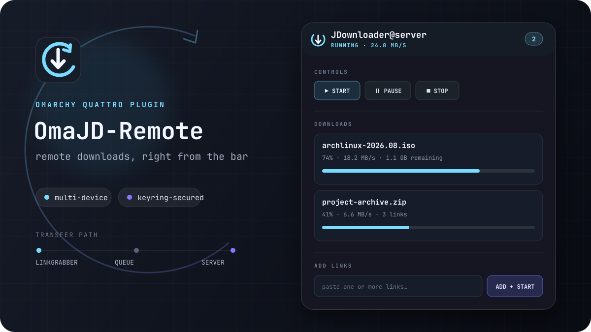

<p align="center">
  
</p>

<h1 align="center">omarchy-OmaJDownLoad</h1>

<p align="center">
  A native Omarchy Quattro bar controller for remote JDownloader instances.
</p>



OmaJDownLoad connects to devices registered with a
[MyJDownloader](https://my.jdownloader.org/) account. JDownloader itself can
run on a server, NAS, or in Docker; nothing has to be installed on the Omarchy
machine.

## What it does

- Discovers all online JDownloader devices in the account
- Switches between devices and remembers the selection
- Starts, pauses, resumes, stops, and force-starts downloads
- Shows package progress, transfer speed, and current controller state
- Adds one or more URLs to LinkGrabber or directly to the download queue
- Receives local Click'n'Load and encrypted CNL2 requests on `127.0.0.1:9666`
- Keeps incoming Click'n'Load requests in a review inbox for the selected device
- Renames, moves, or removes LinkGrabber packages
- Removes download-list entries without deleting downloaded files
- Uses a theme-aware vector mark with animated, paused, and offline states
- Stores the MyJDownloader password in Secret Service, never in `shell.json`
- Supports full keyboard operation, including scrolling focus into view

## Requirements

- Omarchy 4 / Quattro
- Python 3.13 or 3.14 on x86-64 with `venv`
- `secret-tool` from `libsecret`
- A MyJDownloader account (devices may be offline during setup)

## Install from GitHub

```bash
omarchy plugin add https://github.com/flathack/omarchy-OmaJdownLoad.git --enable
```

Click the OmaJDownLoad icon in the bar, choose **Install helper**, then connect
your MyJDownloader account. The helper is installed into an isolated virtual
environment in the user profile; no system package is modified. Every launch
checks the installed distributions against the exact lock-file versions. A
repair install switches environments atomically and retains only the newest
rollback environment.
Additional packages in that isolated environment are tolerated; every locked
direct and transitive dependency must still be present at its exact version.

You can also install the helper from a terminal:

```bash
~/.config/omarchy/plugins/io.github.flathack.omajdownload/install.sh
```

## Controls

| Input | Action |
|---|---|
| Left click | Open or close the control panel |
| Middle click | Refresh status |
| Right click | Pause or resume all downloads |
| `Tab` / `Shift+Tab` | Move through every available action |
| Arrow keys or `h j k l` | Move backward or forward through actions |
| `Enter` / `Space` | Activate the focused action |
| `x` | Trigger the focused destructive action, which still requires confirmation where applicable |
| `a` | Focus the link editor |
| `r`, `s`, `p` | Refresh, start, or pause/resume |
| `Escape` | Leave an editor, then close the panel |
| `Ctrl+Enter` | Submit the link editor to LinkGrabber |

The panel keeps compact start, pause/resume, stop, and refresh controls at the
top. It also offers explicit controls for force-start, LinkGrabber submission,
package renaming, queue movement, and removal. Removing a download entry keeps
the downloaded file on disk.

## Click'n'Load

While the plugin helper is running, OmaJDownLoad provides the standard local
Click'n'Load endpoints at `http://127.0.0.1:9666/flash/`, following the
[JDownloader CNL2 protocol](https://jdownloader.org/knowledge/wiki/glossary/cnl2). Both plain CNL and
encrypted CNL2 requests are supported. Incoming links are not started silently:
they appear in the panel first, where they can be sent to LinkGrabber, added and
started, or dismissed. The current MyJDownloader device selection is used.
Destination hostnames are shown by default; full URLs, including any embedded
tokens, appear only after using the explicit reveal control.
If the remote submission succeeds but its local acknowledgement cannot be
saved, the request is marked **uncertain** and cannot be sent again without an
explicit duplicate-risk confirmation.

The listener is bound to loopback only, limits request size, and never executes
JavaScript supplied by a website. The optional browser companion in
[`browser-extension/`](browser-extension/README.md) bridges mixed-content and
private-network restrictions while leaving final approval in the panel inbox.
For safety and store compatibility, CNL2 `jk` functions that do more than return
a literal 32-character hexadecimal key remain unsupported; the extension does
not evaluate website-provided code.

## Security and local data

OmaJDownLoad runs inside the unsandboxed Omarchy shell, like every Omarchy
plugin. Review the source before enabling it.

- Password: desktop Secret Service keyring
- Non-secret settings: `~/.config/omarchy/omajdownload/config.json`
- Pending Click'n'Load inbox: `~/.config/omarchy/omajdownload/clicknload-inbox.json` (mode `0600`)
- Python environment: `~/.local/share/omajdownload/venv`
- API transport: encrypted MyJDownloader API over HTTPS

Malformed configuration or inbox files are moved aside with a timestamped
`.corrupt-*` suffix before fresh state is written, so their original content is
available for recovery.

The password is passed from QML to the long-lived helper over stdin. It never
appears in process arguments, plugin settings, logs, or `shell.json`.

Dependency versions and artifacts are hash-locked in `requirements.lock`; their licenses are
listed in [THIRD_PARTY_NOTICES.md](THIRD_PARTY_NOTICES.md).

## Remove

First disconnect the account from the bottom of the OmaJDownLoad panel. This
removes its keyring entry and non-secret configuration. Then remove the plugin:

```bash
omarchy plugin remove io.github.flathack.omajdownload
```

The isolated helper environment may be removed separately from
`~/.local/share/omajdownload` if it is no longer needed.

## Development

```bash
./scripts/setup-dev.sh
./scripts/build-extension.sh
```

`setup-dev.sh` creates a cached virtual environment from the hash lock and runs
all Python, shell, manifest, browser-script, and plugin validation checks.
The manual keyboard regression matrix is in
[`docs/keyboard-testing.md`](docs/keyboard-testing.md).

For live development, place a checkout at
`~/.config/omarchy/plugins/io.github.flathack.omajdownload` and enable it.
Omarchy then hot-reloads QML changes.

## License

[MIT](LICENSE)
See [THIRD_PARTY_NOTICES.md](THIRD_PARTY_NOTICES.md) for runtime dependencies.
